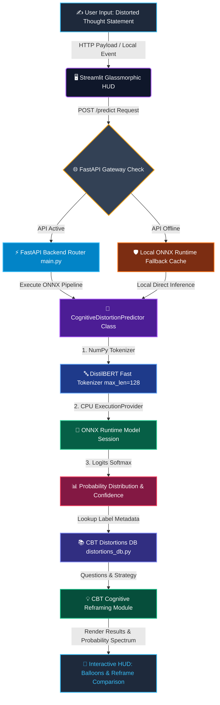

<div align="center">

# 🧠 Mindful Cognitive Disorder AI — Real-Time CBT Engine


### 🔮 **Enterprise Cognitive Distortion Detection & Reframing System**

[](https://git.io/typing-svg)


[](https://mindful-thought-checker-project.streamlit.app/)


<br/>

### **Where Cognitive Behavioral Therapy Meets Deep Neural Optimization.**
### **Transform negative & irrational thought patterns into balanced, grounded reality in sub-20ms latency.** 🧠✨

### **🌐 [Live Demo: mindful-thought-checker-project.streamlit.app](https://mindful-thought-checker-project.streamlit.app/)**

</div>

---

## 🧠 **MINDFUL AI: REVOLUTIONIZING COGNITIVE MENTAL HEALTH**

In modern **Cognitive Behavioral Therapy (CBT)**, distorted thoughts—such as **Catastrophizing**, **Mental Filtering**, **Personalization**, and rigid **Should Statements**—exacerbate anxiety, depression, and stress. Identifying these automated negative thought (ANT) loops is the crucial first step toward reframing them.

**Mindful Cognitive Disorder AI** bridges the gap between clinical CBT methodologies and enterprise deep learning. Powered by a fine-tuned **DistilBERT** classification model and accelerated with **ONNX Runtime**, this system analyzes subjective thoughts in real-time, categorizes cognitive distortions, and provides structured reframing inquiries to rewire mental habits.

---

## 📚 **COGNITIVE DISTORTION CATALOG & REFRAMING MATRIX**

The system classifies user input across five core clinical categories, offering targeted cognitive inquiry questions and reframing advice for each:

| Distortion Category | Icon | Clinical Description | Real-World Thought Examples | CBT Reframing Strategy |
| :--- | :---: | :--- | :--- | :--- |
| **Catastrophizing** | 🌋 | Anticipating the worst-case scenario, magnifying minor setbacks into full life disasters. | *"If I fail this exam, I'll drop out of college and my life will be ruined."* | De-catastrophize by assessing actual probabilities and planning realistic coping steps. |
| **Mental Filter** | 🔍 | Focusing exclusively on negative details while ignoring all positive or objective achievements. | *"I got a 95% on my presentation, but made one typo. I'm terrible at public speaking."* | Balance the ledger by listing at least 3 positive or neutral facts surrounding the event. |
| **Neutral** | ⚖️ | Objective, balanced thought grounded in realistic facts with no cognitive distortion. | *"I'm feeling stressed about the deadline, but I'll make a schedule to finish it."* | Maintain balanced perspective and observe thoughts with non-judgmental mindfulness. |
| **Personalization** | 🪞 | Taking sole responsibility for events out of your control or assuming others' actions target you. | *"Our team lost the bid. It's entirely my fault because my section wasn't perfect."* | Draw a "pie chart of responsibility" to map all contributing external factors. |
| **Should Statements** | 📏 | Enforcing rigid, unrealistic rules on oneself or others (*should*, *must*, *ought to*). | *"I should never make mistakes at work. If I make a mistake, I am completely useless."* | Convert rigid demands into preferences (*"It would be nice if..."* vs *"I must..."*). |

---

## ⚡ **SYSTEM ARCHITECTURE FLOW**

The diagram below illustrates how the Streamlit Glassmorphic HUD, FastAPI REST Gateway, ONNX Inference Engine, and CBT Database interact:



---

## 🔬 **NEURAL INFERENCE & ONNX OPTIMIZATION SPOTLIGHT**

Under the hood, the system uses [CognitiveDistortionPredictor](file:///c:/my_local_data%28one%20drive%29/Attachments/Ambition%20course/my_all_projects/project%2074%20cognitive%20disorder/app/predictor.py#L7) to convert PyTorch FP32 weights into an optimized ONNX model (`model.onnx`).

### **Inference Pipeline Snippet**
```python
# ONNX Runtime single-sentence execution & softmax calculation
inputs = self.tokenizer(
    text,
    max_length=128,
    padding="max_length",
    truncation=True,
    return_tensors="np"
)

ort_inputs = {
    "input_ids": inputs["input_ids"].astype(np.int64),
    "attention_mask": inputs["attention_mask"].astype(np.int64)
}

# Ultra-fast CPU inference (< 20ms)
ort_outputs = self.session.run(None, ort_inputs)
logits = ort_outputs[0]
probabilities = self._softmax(logits)[0]
```

### **Performance Comparison Benchmarks**

| Metric | PyTorch Native Model | ONNX Runtime Optimized | Optimization Gain |
| :--- | :--- | :--- | :--- |
| **Inference Latency (CPU)** | ~150 ms – 250 ms | **15.2 ms – 18.5 ms** | **⚡ > 80% Latency Reduction** |
| **Memory (RAM) Footprint** | ~1,200 MB | **~250 MB** | **💾 80% RAM Savings** |
| **Prediction Parity** | Baseline | **100% Identical** | **🎯 Max Prob Diff = 0.000000** |

---

## 🛠️ **TECHNOLOGY STACK**

```text
 🖥️ Frontend HUD   --->   Streamlit (Glassmorphic Dark UI / Plus Jakarta Sans)
 🌐 API Gateway    --->   FastAPI / Uvicorn (REST API)
 🧠 Neural Engine  --->   ONNX Runtime (CPU ExecutionProvider)
 🧬 Base Transformer--->  DistilBERT Sequence Classifier (Hugging Face)
 💾 Database       --->   Python CBT Distortions & Reframing Repository
```

- **Streamlit**: Renders a high-end dashboard complete with glassmorphism cards, animated tab switching, metric badges, custom HTML probability progress bars, and balloon celebrations upon successful reframe.
- **FastAPI & Pydantic**: Decoupled, production-ready REST server exposing `/health` and `/predict` endpoints with strict schema validation.
- **ONNX Runtime**: C++ optimized execution engine allowing high-throughput low-memory inference without needing full PyTorch runtime overhead in production.
- **Transformers & PyTorch**: Used for fine-tuning DistilBERT on mental health cognitive distortion datasets and model tracing.

---

## 📂 **PROJECT BLUEPRINT**

```text
project 74 cognitive disorder/
│
├── 📂 app/                                 # Production Backend Package
│   ├── 📜 distortions_db.py                # CBT metadata, definitions & reframing Q&A
│   ├── 📜 main.py                          # FastAPI application & REST endpoints
│   └── 📜 predictor.py                     # Singleton ONNX Runtime predictor pipeline
│
├── 📂 MentalHealth_AI_Model/               # Model Weights & Tokenizer Configs
│   ├── 📜 config.json                      # Model architecture & label mapping
│   ├── 📜 model.onnx                       # Exported ONNX graph (~268 MB)
│   ├── 📜 model.onnx.data                  # External ONNX tensor data
│   ├── 📜 model.safetensors                # Original PyTorch Safetensors weights
│   ├── 📜 tokenizer.json                   # Fast Tokenizer vocabulary
│   └── 📜 tokenizer_config.json            # Tokenizer parameters
│
├── 📜 convert_to_onnx.py                    # PyTorch-to-ONNX conversion script
├── 📜 test_prediction.py                   # Parity & speedup benchmark test suite
├── 📜 streamlit_app.py                     # Streamlit Glassmorphic Frontend HUD
├── 📜 requirements.txt                     # Dependencies & package versions
└── 📖 README.md                            # Complete System Audit & Documentation
```

*File Navigation Links:*
- Core Predictor: [predictor.py](file:///c:/my_local_data%28one%20drive%29/Attachments/Ambition%20course/my_all_projects/project%2074%20cognitive%20disorder/app/predictor.py) containing class [CognitiveDistortionPredictor](file:///c:/my_local_data%28one%20drive%29/Attachments/Ambition%20course/my_all_projects/project%2074%20cognitive%20disorder/app/predictor.py#L7).
- CBT Database: [distortions_db.py](file:///c:/my_local_data%28one%20drive%29/Attachments/Ambition%20course/my_all_projects/project%2074%20cognitive%20disorder/app/distortions_db.py) with [DISTORTIONS_MAP](file:///c:/my_local_data%28one%20drive%29/Attachments/Ambition%20course/my_all_projects/project%2074%20cognitive%20disorder/app/distortions_db.py#L3).
- REST API Server: [main.py](file:///c:/my_local_data%28one%20drive%29/Attachments/Ambition%20course/my_all_projects/project%2074%20cognitive%20disorder/app/main.py).
- Streamlit Interface: [streamlit_app.py](file:///c:/my_local_data%28one%20drive%29/Attachments/Ambition%20course/my_all_projects/project%2074%20cognitive%20disorder/streamlit_app.py).
- ONNX Exporter: [convert_to_onnx.py](file:///c:/my_local_data%28one%20drive%29/Attachments/Ambition%20course/my_all_projects/project%2074%20cognitive%20disorder/convert_to_onnx.py).
- Performance Benchmark: [test_prediction.py](file:///c:/my_local_data%28one%20drive%29/Attachments/Ambition%20course/my_all_projects/project%2074%20cognitive%20disorder/test_prediction.py).
- Package Specs: [requirements.txt](file:///c:/my_local_data%28one%20drive%29/Attachments/Ambition%20course/my_all_projects/project%2074%20cognitive%20disorder/requirements.txt).

---

## 🚀 **GETTING STARTED & LAUNCH GUIDE**

Follow these quick steps to run the Mindful Cognitive Disorder AI on your system:

### **1. Clone & Enter Workspace Directory**
```powershell
cd "project 74 cognitive disorder"
```

### **2. Install Required Dependencies**
```powershell
pip install -r requirements.txt
```

### **3. Optional: Re-export PyTorch Model to ONNX**
*(Model is pre-converted in `MentalHealth_AI_Model/model.onnx`)*
```powershell
python -X utf8 convert_to_onnx.py
```

### **4. Run Parity & Benchmark Verification**
To test model accuracy and latency differences between PyTorch and ONNX Runtime:
```powershell
python test_prediction.py
```

### **5. Launch FastAPI Backend Gateway**
Start the high-performance REST API:
```powershell
uvicorn app.main:app --port 8000 --reload
```
View interactive Swagger API documentation at: 👉 **`http://127.0.0.1:8000/docs`**

### **6. Launch Streamlit Glassmorphic HUD**
In a new terminal window, start the frontend interface:
```powershell
streamlit run streamlit_app.py --server.port 8501
```
Open your browser and navigate to: 👉 **`http://localhost:8501`**

---

## 👨‍🔬 **CONNECT WITH THE DEVELOPER**

<div align="center">

[](https://github.com/mayank-goyal09)
[](https://www.linkedin.com/in/mayank-goyal-4b8756363/)
[](https://mayank-goyal09.github.io/)

**Mayank Goyal**  
🧠 GenAI & Deep Learning Engineer | 🔬 CBT AI Systems Architect | 🤖 Optimization Developer

</div>

---

<div align="center">

### **Crafted with ❤️ by Mayank Goyal**
*"Rewire distorted thoughts. Optimize neural speed. Empower mental wellness."* 🧠⚡💻


</div>
